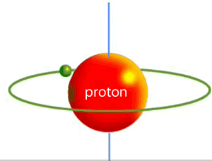

# Team Proton

### Notes
1. These are all very raw original works created in the course of a 2-day hackathon an some amount of work likely would be need to be done to improve quality
1. Within these files the time and zones are are setup as hard-coded variables. To be useful these should be arrays that will can be used within a loop to iterate across datasets
1. It is expected that RAW, Zipped AIS files be manually uploaded to the same direcotry as the notebooks
1. We believe we have identified very valid process to quickly identify potential COLREG interactions without doing point-by-point comparisons (see power point presentation)
1. The current mechanism does not address boundary conditions either in space or time for our "boundary boxes", to include 100% of all COLREG interactions this will be necessary.  To identify a subset to be able to do machine learning this may not be as important
1. The next logical step here is to take the output from InteractionDetection, identify MMSI pairs, then use the tracks created by AIS_ColFilteredCSV to select a +/-2 hour window of time surrounding the potential COLREG interaction an perform additional analysis.  Since we are just using the initial screening to identify the interactions, these tracks would not have the same boundary condition problems with the exception of month and zone boundarys  which are much less common  

### Repository Contents
1. Notebooks/AIS_RawProcessing.ipynb - Expects raw AIS Zip files to be at the same level of the notebook.  Will break down zip files as specified into 15 minute CSV files.
1. Notebooks/AIS_BoundingBox.ipnyb - Takes the original 15 minute slices of data and break them into a set of files with all points bounded by a latitude and longitude into a bounding box
1. Notebooks/InteractionDetection.ipnyb - Goes through a specific boundingbox, sort by latitude and longitude, time and MMSI, resulting changes indicate potential COLREG interactions
1. AIS_ColFilteredCSV - Simple C# application (very hack-is) to crunch through all the AIS points in a zone for a month and produce tracks for a vessel.
1. HackTheMachine_Full.pptx - Original power point that describes our solution
